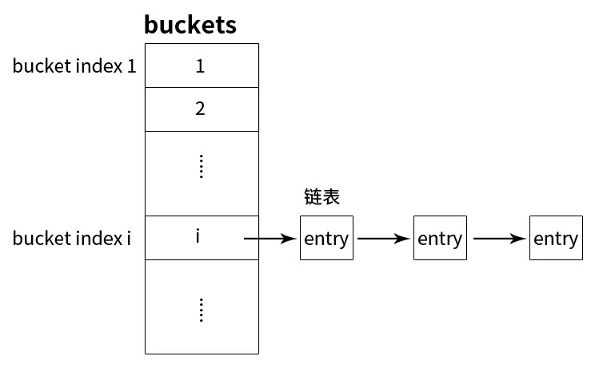

# libshmcache_annotated

这个rep是我在阅读[libshmcache][1]时的一份代码注释。

`libshmcache`的特性：
* 支持多个进程访问本机的共享内存。
* 使用Hashtable，支持快速的set, get, delete。
* 支持一个写者多个读者的场景下无锁访问。
* 多个写者的场景下，用`pthread_mutex`加锁。
* 当写时，如果当前的共享内存空间已满、且已经达到最大值，则会按FIFO策略来淘汰hash entry。
* 以一次次地申请shm segment的方式来分配共享内存，按需向OS申请shm segment。
* key的长度限制在64字节以内。
* 多个写者操作时，如果一个写者加锁后崩溃，会导致`pthread_mutex`一直处于已锁住的状态。`libshmcache`支持在这种场景下的死锁检测和恢复。

### 阅读笔记

#### 存储模型

程序以segment（默认8M）为单位向OS申请共享内存。初始化时，会分配几个segment，然后将每个segment切分成多个striping_allocator空间（默认1M），由striping_allocator来分配单个的hash entry空间。  
hash entry由`struct shm_hash_entry`表示，主要记录hash entry在striping_allocator中的偏移量（准确的说，是基于segment首地址的偏移量）。  
所有striping_allocator对象由`shmcache_value_allocator_context`来管理，它由2个ring queue(`doing`, `done`)分别保存所有空闲的striping_allocator和已分配满的striping_allocator。如下图所示。  

segment是按需分配的。在插入时，若当前striping_allocator分配满了，会从`doing` ring queue中取一个空闲的striping_allocator，然后再分配hash entry空间。若所有striping_allocator都分配满了，则向OS申请一块新的setment。    
Hashtable使用是正规的开链法实现。如下图所示，hash桶的个数是`context->memory->hashtable->capacity`，由配置`max_key_count`指定。  

#### get(key)操作

1. 根据key哈希计算得到bucket index。计算公式：`hash(key->data, key->length) % context->memory->hashtable.capacity`

2. （从`context->memory->hashtable.buckets[bucket index]`）获取bucket index对应的桶链表首结点在shm segment中的偏移量，根据偏移量得到此结点在shm中的地址。

3. 遍历桶链表，直到找到key相同且未过期的hash结点。

#### set(key,value)操作

1. 加pthread_mutex锁。若尝试几次都加锁失败，则启动**死锁检测机制**。

2. 若当前存储的key/value个数已达到设定的最大值，则启动shm淘汰策略，淘汰一些过时的key/value，以释放空间。

    淘汰策略的实现思路：  
1）在context中有个`struct shmcache_list list`链表，保存着shm中所有hash entry（在shm segment）的偏移量。  
2）从前往后遍历链表中的结点，然后删除此hash entry、释放空间。  
3）直到释放了`recycle_keys_once`个hash entry空间，或者释放了一个striping_allocator空间。  
4）当回收了有效的(未过期)键值对时，进程sleep一段时间，以避免其他进程读到脏数据（读到新写的不完整的数据）。  

    PS: 为什么要按FIFO策略来淘汰hash entry，而不是LRU之类？  
我猜想是为了释放一个striping_allocator对象的空间，而一个striping_allocator对象的空间是由连续的几个key entry来瓜分的，所以需要释放连续的hash entry。

3. 从当前的striping_allocator中分配一个hash entry空间（记为`new_entry`）。

    如果当前的striping_allocator空间不足，则从`doing` ring queue中取一个空闲的striping_allocator，然后再分配hash entry空间。
如果所有striping_allocator都分配满了，则启动淘汰策略（释放一些旧的hash entry空间），或者向OS申请一块新的shm segment空间。

4. 从Hashtable中查询是否已存在这个key。（原来的key占用的空间记为`old_entry`）
如果存在，则修改桶链表中`old_entry`前驱结点的`next索引`，再释放`old_entry`空间。
如果不存在，则将`new_entry`插入作为桶链表的首结点。

5. 将key/value值拷贝到`new_entry`空间中。如果没有冲突，修改`context->memory->hashtable.buckets`索引（存储桶链表首结点的偏移量）。如果有冲突，则链接到桶链表的最后一个结点中。

6. 将`new_entry`的偏移信息插入到conext->list中。

#### delete(key)操作

1. 加pthread_mutex锁。若尝试几次都加锁失败，则启动**死锁检测机制**。
2. 从Hashtable中查询这个key占用的hash entry地址。具体的查询过程与`get(key)操作`类似。
3. 从桶链表中删除这个hash entry，并释放它占用的shm空间。
4. 从`conext->list`链表中删除这个结点。

#### 如何保证一个写者多个读者同时进行时的无锁访问？

1. 当回收了有效的(未过期)键值对时，写进程sleep一段时间，以避免其他进程读到脏数据（读到新写的不完整的数据）。
2. 把KV结构中的数据完全准备好后，才会挂到hashtabe的bucket链表中。
3. 在桶链表中插入新结点时，将它链接作为**最后一个结点**。

一种读者查询失败的场景：  
在set(key,value)操作中，如果已存在这个key，需要将原来key的hash entry从桶链表中删除。在删除过程中，需要修改些entry结点的前驱结点的`next索引`，但如果此时正好有个读者读到这个结点，在遍历时，由于写进程已将原结点next指针置为NULL，导致后续的链表读不到了。

#### 死锁检测

采用pthread mutex互斥锁（跨进程的锁），在拿到锁后，记录当前进程的pid，即锁的owner进程pid。  
加锁时采用trylock尝试加锁，如果没有拿到锁，则休眠N微秒后重新trylock。  
如果达到deadlock检测阈值（比如1s）还没拿到锁，则启动deadlock检测。  
检查持有锁的pid是否存活，如果该进程已经挂掉，则执行解锁操作，deadlock问题解决。  
PS: 我觉得用`文件锁`更好，因为当一个已加锁的进程异常退出时，OS会自动释放该进程的资源（释放该进程占用的文件锁）。

#### 异常处理

有时候会出现写数据不完整(一个进程写一部分数据后崩溃或被kill掉)、不一致的情况，这个怎么处理？  
直接把整个cache清除掉。因为是cache系统，不保证（承诺）数据持久化，所以万一出现这种bad case，就把cache清空了。

附：[数据结构图][2]

[1]: https://github.com/happyfish100/libshmcache
[2]: https://github.com/baozh/libshmcache_annotated/blob/master/data_structure.jpeg
[3]: segment.png 
[4]: ring_queue.png
[5]: buckets.png
